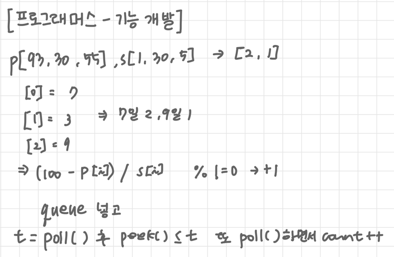

# 코딩테스트 문제 풀이

## 📘 문제 제목
[프로그래머스 - 기능 개발](https://school.programmers.co.kr/learn/courses/30/lessons/42586)
### 🧠 문제 이해

- 배포까지 남은 일 수 계산하기
- **Queue** 로 풀기!

---

### ✏️ 슈도 코드

```plaintext
배포까지 남은 일 수 : (100 - p[i]) / s[i] -> (100 - p[i]) % s[i] != 0 -> + 1
queue 에 넣고 poll() 이랑 peek() 비교해서 꺼내기!
```

---

### ✅ 전체 코드
```java
import java.util.*;

class Solution {
  public int[] solution(int[] progresses, int[] speeds) {
    List<Integer> answer = new ArrayList<>();
    Queue<Integer> queue = new LinkedList<>();

    for (int i = 0; i < progresses.length; i++) {
      int r = 100 - progresses[i];
      if (r % speeds[i] != 0) {
        queue.add(r / speeds[i] + 1);
      } else {
        queue.add(r / speeds[i]);
      }
    }
    while (!queue.isEmpty()) {
      int top = queue.poll();
      int count = 1;
      while (!queue.isEmpty() && top >= queue.peek()) {
        queue.poll();
        count++;
      }
      answer.add(count);
    }

    return answer.stream().mapToInt(i -> i).toArray();
  }
}
```

### 🔍 알아두기!

```java
int r = 100 - progresses[i];
if (r % speeds[i] != 0) {
    queue.add(r / speeds[i] + 1);
} else {
    queue.add(r / speeds[i]);
}

// Math.ceil() 적용
int r = (int) Math.ceil((100.0 - progresses[i]) / speeds[i]);
queue.add(r);
```

- Math.ceil() (올림 함수) 이용하면 간단하게 표현 가능!
- **Math.ceil()**
  - 입력받은 숫자를 올림한 정수를 리턴하는 함수
  - 정확한 올림 계산을 위해 실수형으로 계산해야 함!
    - 10/4 -> 2.0  둘 다 정수라 소수점이 버려지므로 올림해도 2.0
    - 10.0/4.0 -> 3.0  실수형으로 계산하면 2.5 를 올림해서 3.0 으로 원하는 값!
