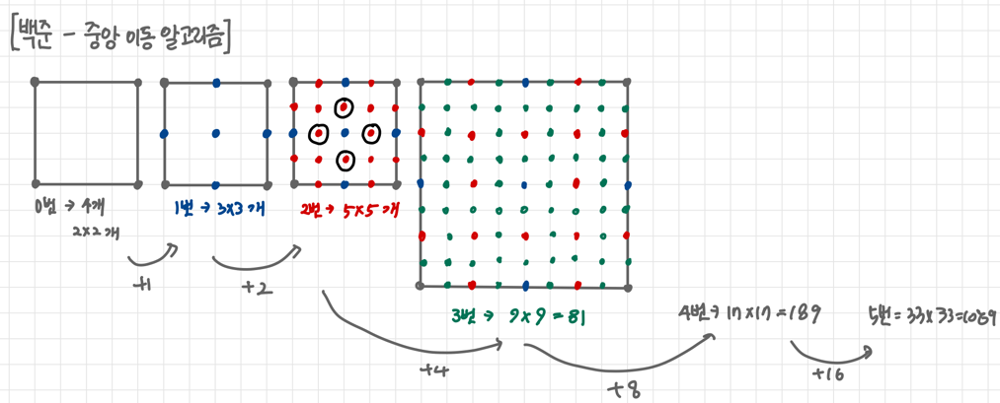

# 코딩테스트 문제 풀이

## 📘 문제 제목
[백준 - 중앙 이동 알고리즘](https://www.acmicpc.net/problem/2903)

### 🧠 문제 이해


- (2 + (2^1 ... + 2^n))^2

---

### ✏️ 슈도 코드

```plaintext
부분합 만들어서 풀기!
sum[i] = sum[i - 1] + 2^(i-1)
answer = sum[n]^2
```

---

### ✅ 전체 코드
```java
import java.util.*;

public class Main {
  public static void main(String[] args) {
    Scanner sc = new Scanner(System.in);
    
    int n = sc.nextInt();
    int[] sum = new int[n + 1];
    
    sum[0] = 2;
    for (int i = 1; i <= n; i++) {
      sum[i] = sum[i - 1] + (int) Math.pow(2, i - 1);
    }
    System.out.println(sum[n] * sum[n]);
  }
}
```
