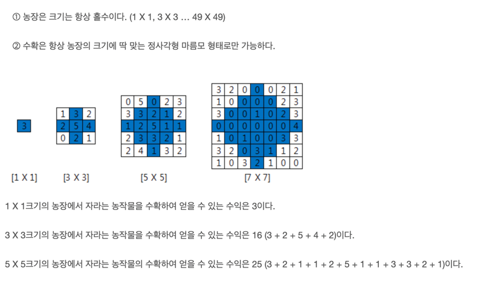

# 코딩테스트 문제 풀이

## 📘 문제 제목
[SWEA - 농작물 수확하기](https://swexpertacademy.com/main/code/problem/problemDetail.do?problemLevel=3&contestProbId=AV7GLXqKAWYDFAXB&categoryId=AV7GLXqKAWYDFAXB&categoryType=CODE&problemTitle=&orderBy=INQUERY_COUNT&selectCodeLang=ALL&select-1=3&pageSize=10&pageIndex=1)

### 🧠 문제 이해
- N x N 농장에서 크기에 딱 맞는 정사각형 마름모 형태로 수확가능 할 때, 얻을 수 있는 수익 구하기
   


---

### ✏️ 슈도 코드

```plaintext
min = n / 2 + 1
i:
  j:
    k: i <= mid ? i : n - 1 - i
    mid - k <= j <= mid + k:
        sum += num[i][j]
```

---

### ✅ 전체 코드
```java
import java.util.*;
import java.io.FileInputStream;

class Solution
{
  public static void main(String args[]) throws Exception
  {
    Scanner sc = new Scanner(System.in);
    int T;
    T=sc.nextInt();

    for(int test_case = 1; test_case <= T; test_case++)
    {
      int n = sc.nextInt();
      sc.nextLine();

      int[][] nums = new int[n][n];
      for (int i = 0; i < n; i++) {
        nums[i] = Arrays.stream(sc.nextLine().split(""))
          .mapToInt(Integer::parseInt)
          .toArray();
      }

      int mid = n / 2;
      int sum = 0;
      for (int i = 0; i < n; i++) {
        int ran = i <= mid ? i : n - 1 - i;
        for (int j = mid - ran; j <= mid + ran; j++) {
          sum += nums[i][j];
        }
      }
      System.out.println("#" + test_case + " " + sum);
    }
  }
}
```
